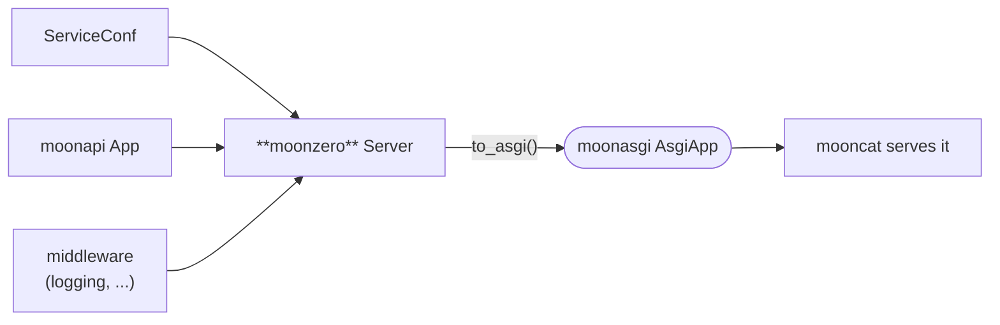

<div align="center">

# moonzero

**A service framework for MoonBit — `← go-zero`.**

[](https://github.com/Lfan-ke/moonzero/actions/workflows/ci.yml)
[](./LICENSE)
[](https://mooncakes.io/docs/Lfan-ke/moonzero)

</div>

`moonzero` is the integration layer of the **moon\*** suite — the role `go-zero` plays for Go. It assembles a [`moonapi`](https://github.com/Lfan-ke/moonapi) application from config, wraps it in middleware, and produces a runnable [`moonasgi`](https://github.com/Lfan-ke/moonasgi) `AsgiApp` that a server (`mooncat`) runs. It depends only on `moonapi` + `moonasgi`, so it stays backend-agnostic.



## Quickstart

```moonbit
let app = @moonapi.App::new()
let api = @moonzero.Group::new(app, "/api/v1")     // prefix a set of routes
api.get("/ping", _ctx => @moonapi.text(200, "pong"))

let conf = @moonzero.ServiceConf::new(
  name="greet", host="127.0.0.1", port=8888, timeout_ms=3000, log_level=Info,
)
let server = @moonzero.Server::new(conf, app)
  .use_(@moonzero.cors(@moonzero.CorsConf::new()))   // Access-Control-* headers
  .use_(@moonzero.request_id())                      // x-request-id per request
  .use_(@moonzero.recovery)                           // 500 instead of a panic
  .use_(@moonzero.logging)

server.describe()        // "greet listening on 127.0.0.1:8888"
@mooncat.serve(server.to_asgi(), host=conf.host, port=conf.port)   // run it (native)
```

Verified across all backends (`wasm`, `wasm-gc`, `js`, `native`) in CI, 0 warnings under `--deny-warn`.

## Resilience middleware

Beyond the base onion (logging, recovery, CORS, request-id), moonzero ships go-zero's resilience set, each modelled as a pure decision core over an injected [`Clock`](./clock.mbt) so its timing is exactly testable:

```moonbit
let clock = @moonzero.Clock::new(() => now_ms())     // real time at the async edge
let server = @moonzero.Server::new(conf, app)
  .use_(@moonzero.maxbytes(1 << 20))                                   // 413 over 1 MiB
  .use_(@moonzero.rate_limit(@moonzero.TokenBucket::new(100.0), clock))// 429 when empty
  .use_(@moonzero.breaker(@moonzero.Breaker::new(), clock))            // 503 while open
  .use_(@moonzero.timeout(3000L, clock))                              // deadline
  .use_(@moonzero.structured_logging(clock))                          // one JSON line/req
```

- **`rate_limit`** — a [`TokenBucket`](./ratelimit.mbt): admits a burst, refills continuously, answers `429` when empty.
- **`breaker`** — a [`Breaker`](./breaker.mbt) closed/open/half-open state machine: trips after K consecutive failures, fails fast with `503`, then admits half-open probes to test recovery.
- **`timeout`** — a [`Deadline`](./limits.mbt) enforced on the response path. Preemptively aborting a hung handler needs racing it against a timer (`@async.any`) under the native runtime; that race is wired at the async server edge, the deadline core is portable and tested.
- **`maxbytes`** — rejects a request whose declared `Content-Length` exceeds the limit with `413`.
- **`structured_logging`** — a [`RequestLog`](./logging.mbt) rendered as one JSON line per request (method, path, status, duration, request-id, client-ip, user-agent).

## Auth, YAML config, and zRPC groups

```moonbit
// JWT HS256 — self-built SHA-256/HMAC (verified against NIST/RFC vectors)
let token = @moonzero.jwt_sign(
  Map([("sub", Json::string("alice")), ("exp", Json::number(1893456000.0))]),
  "topsecret",
)
let server = @moonzero.Server::new(conf, app)
  .use_(@moonzero.auth("topsecret", clock))   // 401 unless a valid Bearer JWT

// YAML config — the etc/*.yaml format go-zero ships, same lenient defaults as JSON
let conf = @moonzero.ServiceConf::from_yaml("name: greet\nport: 9000\nlog_level: error\n")

// zRPC service groups over moonrpc — register Method handlers, dispatch by gRPC path
let rpc = @moonzero.RpcServer::new(@moonzero.RpcServerConf::new(name="greeter", port=9090))
rpc.group("hello.Greeter").register("SayHello", req => handle(req))
rpc.dispatch("/hello.Greeter/SayHello", request)   // Ok(bytes) | Err(Unimplemented)
```

- **`jwt_sign` / `jwt_verify`** — compact HS256 tokens on a [self-built SHA-256 + HMAC-SHA256](./crypto.mbt), signatures compared in constant time, `exp`/`nbf` enforced, and the `alg:none` downgrade refused. Interop-verified against the canonical jwt.io token.
- **`auth`** — the [middleware](./auth.mbt) that requires `Authorization: Bearer <jwt>` and answers `401` for an absent, malformed, tampered, or expired token.
- **`ServiceConf::from_yaml`** — a [minimal-subset YAML parser](./yaml.mbt) (block maps, nesting, sequences, typed scalars, comments) feeding the same field reader as the JSON loader, so both formats agree field-for-field.
- **`RpcServer` / `RpcGroup`** — [config-driven zRPC groups](./rpc.mbt) that register [`moonrpc`](https://github.com/Lfan-ke/moonrpc) `Method` handlers by gRPC path and dispatch unary calls, returning `Unimplemented` for an unknown method.

## Roadmap (transliterating go-zero)

Typed config (JSON + YAML loading with defaults, timeout + log level) + service assembly + the base middleware onion (logging, recovery, CORS, request-id) + the resilience set (timeout, rate-limit, breaker, maxbytes, structured logging) + route groups + JWT auth + zRPC service groups are here. Next, feature-by-feature: metrics/tracing/prometheus middleware, the real h2 transport under `moonrpc` for live RPC, and service discovery / registry (etcd/consul) — plus `moonctl`-driven scaffolding of a full `moonzero` service from a spec.

## License

Apache-2.0.
